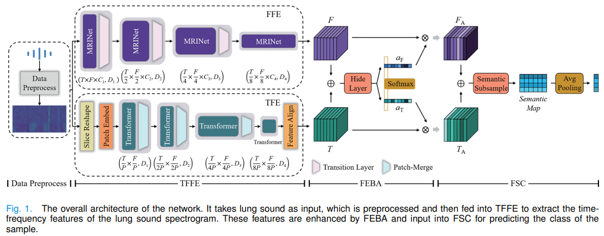
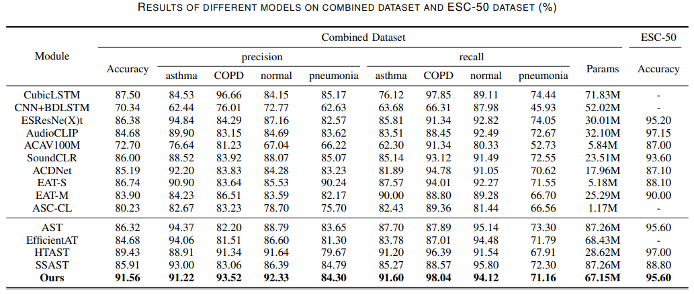

# Lung Sound Recognition Method Based on Multi-Resolution Interlaced Net and Time-Frequency Feature Enhancement


## Introduction

The Code Repository for  "[Lung Sound Recognition Method Based on Multi-Resolution Interlaced Net and Time-Frequency Feature Enhancement]".

Air pollution and an aging population have caused the increasing rates of lung diseases and elderly lung diseases year by year. At the same time, the outbreak of COVID-19 has brought challenges to the medical system. This raises higher requirements for the prevention and diagnosis of lung diseases. Analyzing lung sound signals by using artificial intelligence technology could alleviate the pressure of lung disease diagnosis. Currently, it is difficult for most lung sound recognition models to maintain the correlation between time domain and frequency domain information. And the models based on convolutional neural network hard to focus on multi-scale features at different resolutions. Feature fusion also ignores the differences in the influence between time and frequency features. To address these issues, a lung sound recognition model based on multi-resolution interlaced net and time-frequency feature enhancement is proposed, which consists of a heterogeneous dual-branch time-frequency feature extractor, a time-frequency feature enhancement module based on branch attention, and a fusion semantic classifier based on semantic mapping. The feature extractor independently extracts the frequency domain and time domain information of lung sound signals through a multi-resolution interlaced net and Transformer, which maintains the correlation between time-frequency features. The feature enhancement module focuses on the differences in the influence of frequency domain and time domain information on prediction results by branch attention. The classifier maps the output feature map to a semantic map through semantic downsampling and then performs the classification, which considers both parameter quantity and accuracy. Experimental results on a combined dataset show that the proposed model outperforms other models, with an accuracy improvement of over 2.13%.



## Classification Results on Combinded dataset and ESC-50(%)

<p align="center">

</p>


## Getting Started

### Install Requirments
```
pip install -r requirements.txt
```


### Train and Evaluation

All scripts is run by main.py:
```
Train: CUDA_VISIBLE_DEVICES=1,2 python main.py train

### Model Checkpoints:

We provide the model checkpoints on three datasets (and additionally DESED dataset) in this [link](https://drive.google.com/drive/folders/1f5VYMk0uos_YnuBshgmaTVioXbs7Kmz6?usp=sharing). Feel free to download and test it.

Test: CUDA_VISIBLE_DEVICES=1,2 python main.py test
```
